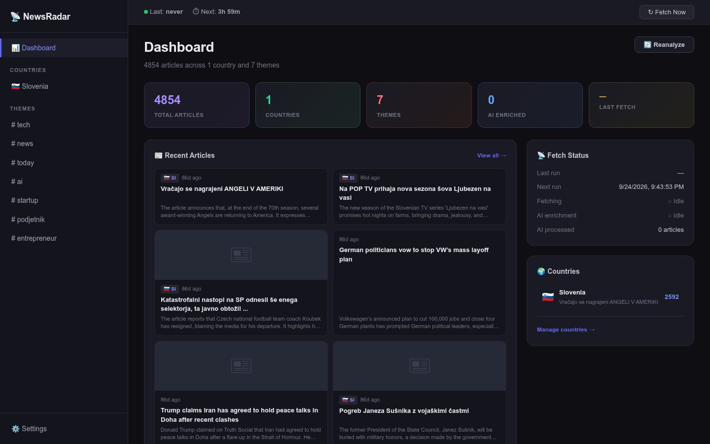
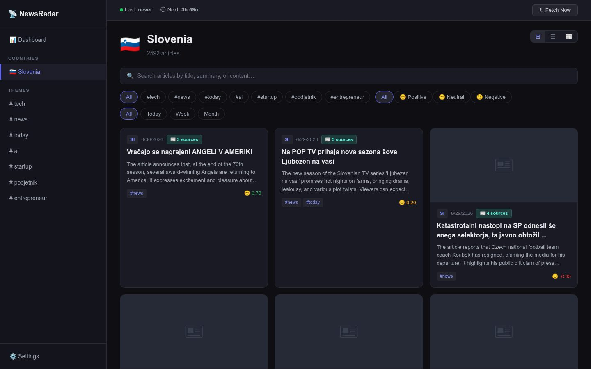
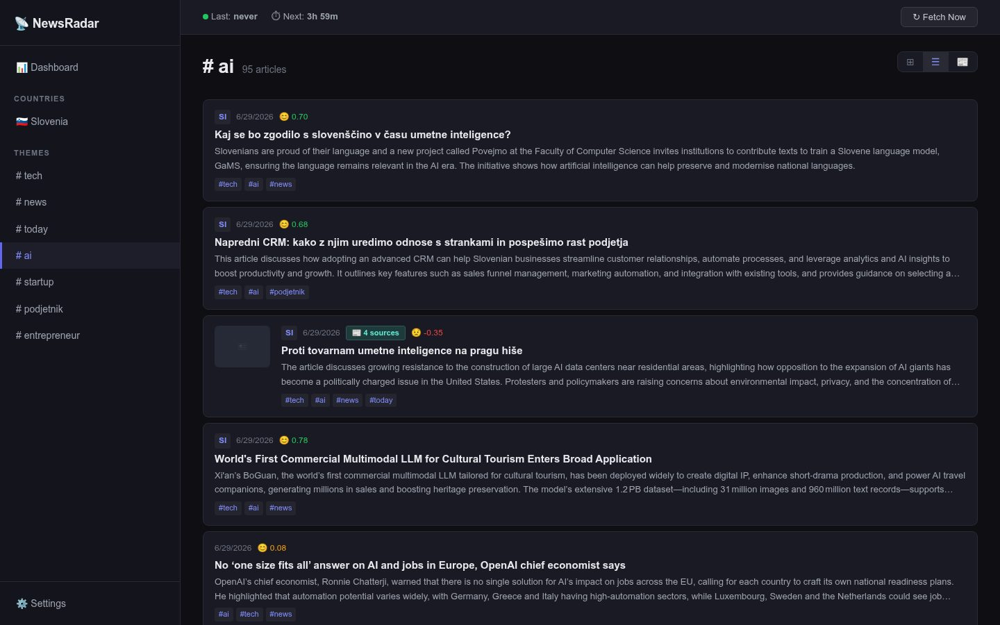
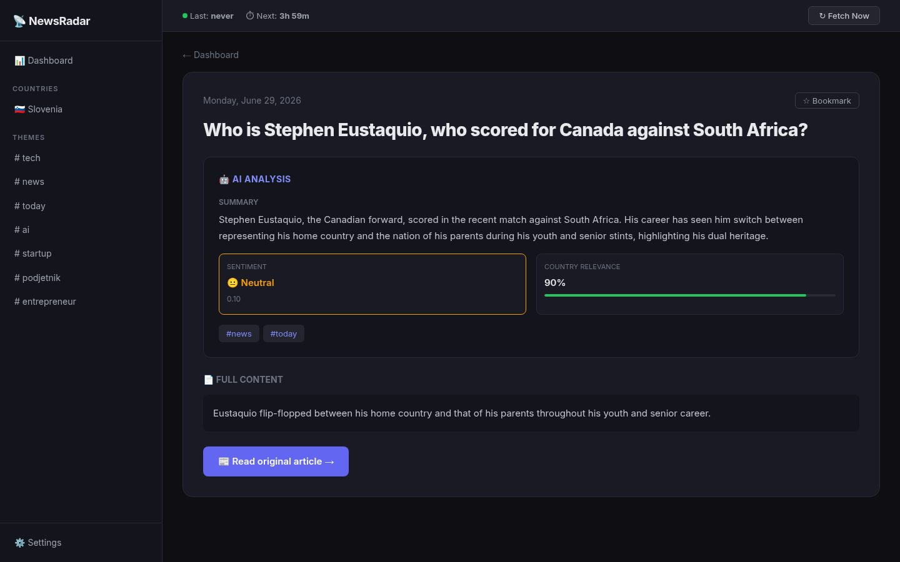

# NewsRadar

**A self-hosted news radar that collects articles from your own sources and has a local model summarise and classify them.** NewsRadar pulls news from RSS/Atom feeds, NewsAPI, GNews and custom browser scrapers on a schedule, then runs each article through a local Ollama model for a short summary, theme tags, a sentiment score and a country relevance score.

When two sources report the same story, the articles are grouped together, so one story shows up once with every source that covered it.



> Screenshots show a demo instance with public news articles.

| Country view | Theme list |
|---|---|
|  |  |



## Features

- **Four kinds of source.** RSS/Atom feeds, NewsAPI and GNews queries, and Playwright scrapers for sites that are rendered in JavaScript or have no feed.
- **Local AI enrichment.** One structured prompt per article to Ollama returns a 2–3 sentence English summary, themes from your own list, sentiment from -1 to +1 and relevance to the tracked country.
- **Story grouping.** After enrichment, each article is compared with recent ones from the same country; similar articles are merged into a group with a combined theme set, average sentiment and a source switcher.
- **Deduplication.** Exact URL matches and near-identical titles are dropped before anything is saved.
- **Views by country and theme.** Pages for a country, for a theme across all countries, and for the intersection of both.
- **Dashboard.** Recent articles, theme and sentiment breakdowns, per-source health (successes, failures, scrape time, last error), fetch status and an activity log.
- **Suggested themes and countries.** Themes the model detects that aren't in your list are counted and can be added with one click.
- **Three layouts.** Card, list and magazine views, remembered between visits.
- **Search and filters.** Text search plus filters for country, theme, sentiment range, date range, and read or bookmarked status.
- **Reading helpers.** Bookmarks, read tracking, keyboard shortcuts and toast notifications when a fetch or AI run finishes.
- **Scheduled fetching.** Runs every 2 to 24 hours, with a manual trigger and a live progress bar.

## Tech stack

Python · FastAPI · SQLAlchemy (async) · SQLite · APScheduler · feedparser · httpx · Playwright · Ollama · React · Vite · Zustand

## How it works

NewsRadar is a single FastAPI service that also serves the built React frontend. A fetch cycle runs in two phases, so new articles appear in the UI straight away and AI work catches up in the background:

```
sources ──► scrape ──► dedup (URL, title) ──► save
                                                │
                     ┌──────────────────────────┘
                     ▼
        Ollama: summary, themes, sentiment, relevance
                     │
                     ▼
        similarity check ──► merge into story group
```

Settings (tracked countries, themes, fetch interval, model, API keys) and all articles live in one SQLite database. New Playwright scrapers are small Python classes registered as a source.

## Availability

The source code is not public. NewsRadar is available for licensing, custom deployment or white-label adaptation. Get in touch via [munda.si](https://www.munda.si/#contact).

## License

Proprietary. © 2026 MUNDA PLUS d.o.o. All rights reserved. See [LICENSE](LICENSE).

## Author

Built by [Marko Munda](https://www.munda.si/) · [Munda Plus](https://github.com/MundaPlus)
